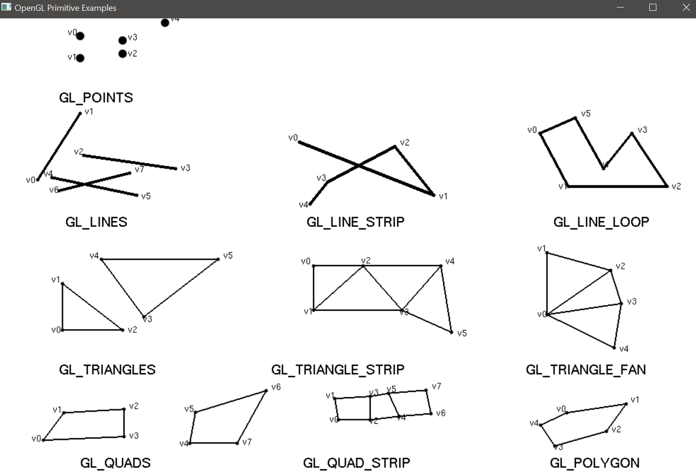
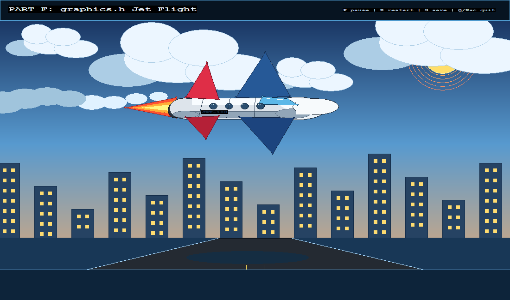

# Computer Graphics Practical Portfolio

This repository contains the completed graphics practical parts, with each part kept in its own source folder and documented with output screenshots.

## Part A - OpenGL Lines And Shapes

Part A renders the OpenGL primitive reference sheet using GLUT. It demonstrates points, lines, line strips, line loops, triangles, triangle strips, triangle fans, quads, quad strips, and polygons.



Source: `src/primitive_catalog.cpp`

## Part B - 3D Cartoon Character Scene

Part B is a 3D OpenGL/freeGLUT scene showing a large near-plane cartoon character against a far-plane city, trees, clouds, sun, path, and skyline. It uses perspective, depth testing, lighting, materials, and camera orbit controls.


Source: `modules/frontier_scene/frontier_scene.cpp`

## Part C - Business Card Design

Part C contains the front and back business card designs.

<table>
  <tr>
    <td align="center">
      <br>
      <sub>Business card front</sub>
    </td>
    <td align="center">
      <br>
      <sub>Business card back</sub>
    </td>
  </tr>
</table>

## Part E - graphics.h Lines And Shapes

Part E recreates the same Part A primitive sheet using the `graphics.h` / WinBGIm library in C/C++. The recreated page uses BGI drawing calls such as `line`, `fillellipse`, and `outtextxy` while matching the Part A layout and labels.


Source: `modules/retro_bitmap/part_e_graphics_h.cpp`

## Part F - Jet Flying Across The Screen

Part F modifies a hello-world-style `graphics.h` program into an animated jet flying across the screen. It includes a gradient sky, clouds, city background, runway perspective, smooth-edged jet components, contrail, shadow, and animated afterburner.



Source: `modules/sky_jets/part_f_jet_graphics_h.cpp`

## Build Notes

OpenGL parts use MinGW/freeGLUT. The `graphics.h` parts use the vendored WinBGIm files in `modules/retro_bitmap/vendor/winbgim`.

Build Part E:

```powershell
cd modules\retro_bitmap
powershell -ExecutionPolicy Bypass -File .\build.ps1
```

Build Part F:

```powershell
cd modules\sky_jets
powershell -ExecutionPolicy Bypass -File .\build.ps1
```
