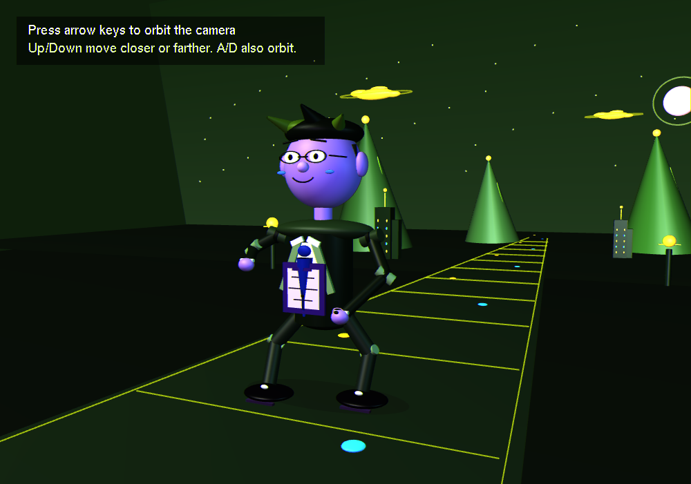

# Part B - 3D Cartoon Character Near/Far Plane

This is a separate OpenGL/freeGLUT C++ project for Part B of the Computer Graphics assignment.

## Hosted Output Page

[https://gl.applications.co.zw/demos/near-far.html](https://gl.applications.co.zw/demos/near-far.html)

## Screenshot



## What It Shows

- A large smooth 3D-style formal cartoon character in the foreground to represent the near plane.
- Smaller mountains, trees, clouds, buildings, sun, ground, and path behind the character to represent the far plane.
- Rounded connected body parts using OpenGL/GLUT 3D primitives: `glutSolidSphere`, `gluCylinder`, `gluCylinder` cones, `glutSolidCube`, and `glutSolidTorus`.
- Perspective depth using `gluPerspective()` and `gluLookAt()`.
- 3D rendering settings: `GL_DEPTH_TEST`, `GL_LIGHTING`, `GL_LIGHT0`, `GL_SMOOTH`, materials, and normalized scaled shapes.
- Character details: formal suit jacket, white shirt, tie, glasses, polished shoes, wristwatch, document portfolio, smooth hinge joints, bent walking stance, hair, facial expression, and shadow.
- Keyboard control: pressing movement keys moves the camera instead of moving the character.
- Orbit keys circle the camera around the formal character in 3D.
- The character remains centered and stationary as the near-plane object while the viewer moves around it.
- The default view starts from a slight side angle, with a one-time on-screen arrow-key instruction.
- Far-plane houses, trees, mountains, clouds, and sun stay behind the character to support the near/far depth view.
- Facial animation: blinking eyes and a subtle animated smile.
- Larger neon cloud clusters without watermark text.

## Files

- `frontier_scene.cpp`: main C++ OpenGL source file.
- `part_b_camera_orbit_screenshot.png`: captured screenshot of the final formal character camera-orbit scene.
- `part_b_cartoon_character_camera_instructions.exe`: compiled formal-character interactive 3D camera program with one-time instructions.

## Build

From this folder, compile with MinGW/freeGLUT:

```powershell
C:\msys64\mingw64\bin\g++.exe frontier_scene.cpp -o part_b_cartoon_character_camera_instructions.exe -IC:\msys64\mingw64\include -LC:\msys64\mingw64\lib -lfreeglut -lopengl32 -lglu32
```

## Run

```powershell
.\part_b_cartoon_character_camera_instructions.exe
```

## Controls

- `W` / `Up Arrow`: move the camera closer to the character
- `S` / `Down Arrow`: move the camera farther from the character
- `A` / `Left Arrow`: orbit the camera left around the character
- `D` / `Right Arrow`: orbit the camera right around the character
- `E`: raise the camera
- `C`: lower the camera
- `R`: reset the camera and character facing direction
- `P`: save a screenshot as `part_b_3d_cartoon_scene.ppm`
- `Q` or `Esc`: close the program
