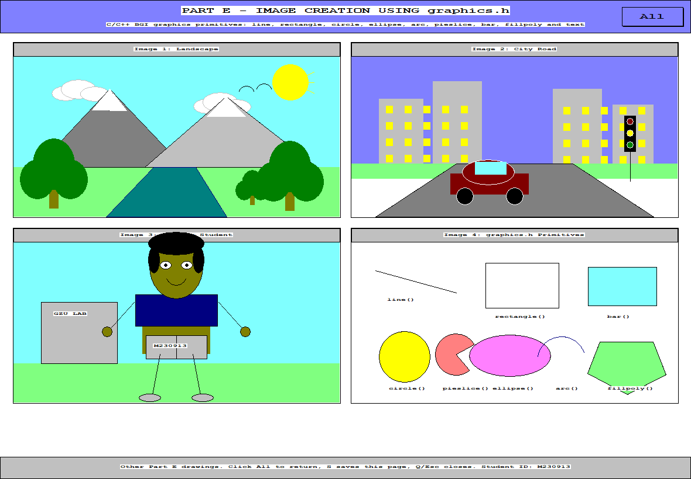
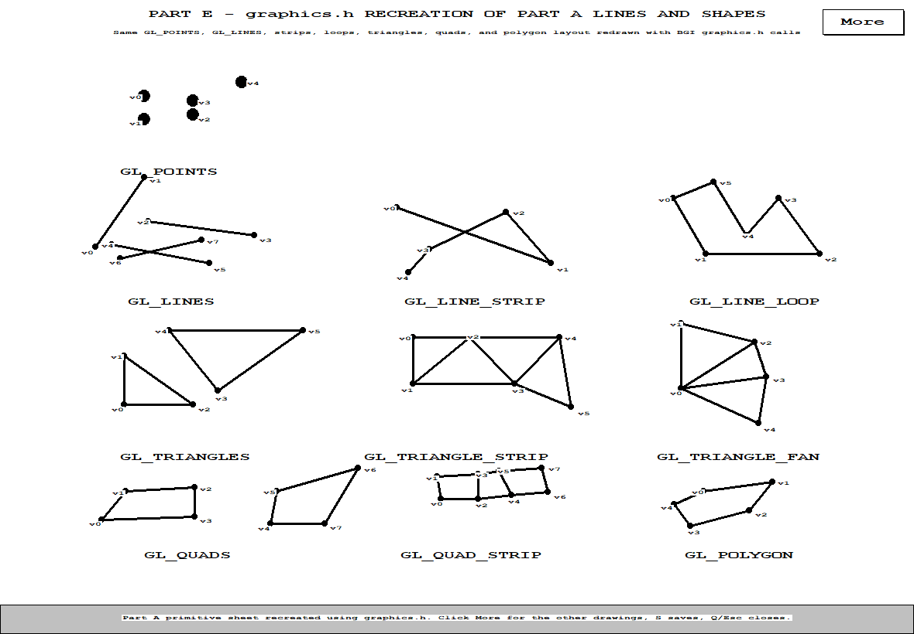

# Part E - graphics.h Image Creation

This folder contains a separate C/C++ `graphics.h` submission for Part E. The program opens first on a `graphics.h` recreation of the Part A OpenGL lines-and-shapes reference sheet, then the small top-right `More` button opens the other Part E drawings.

## Hosted Output Page

[https://gl.applications.co.zw/parts/part-e.html](https://gl.applications.co.zw/parts/part-e.html)

## Screenshots

<table>
  <tr>
    <td align="center">
      <br>
      <sub>Overview page containing the completed graphics.h drawing set.</sub>
    </td>
    <td align="center">
      <br>
      <sub>Part A primitive sheet recreated with graphics.h drawing calls.</sub>
    </td>
  </tr>
</table>

## What It Shows

The program draws four complete 2D images in one window using classic BGI/WinBGIm drawing functions:

- Landscape image with sun, clouds, mountains, river, trees, and birds.
- City road image with buildings, windows, road perspective, traffic lights, and a car.
- Cartoon student image with school background, character, book, and student ID.
- Primitive demonstration image showing `line()`, `rectangle()`, `bar()`, `circle()`, `ellipse()`, `arc()`, `pieslice()`, and `fillpoly()`.
- Part A lines-and-shapes recreation page showing the same `GL_POINTS`, `GL_LINES`, `GL_LINE_STRIP`, `GL_LINE_LOOP`, `GL_TRIANGLES`, `GL_TRIANGLE_STRIP`, `GL_TRIANGLE_FAN`, `GL_QUADS`, `GL_QUAD_STRIP`, and `GL_POLYGON` layout, redrawn using `graphics.h`.

## Files

- `part_e_graphics_h.cpp`: main C++ source file using `#include <graphics.h>`.
- `part_e_graphics_h_output.bmp`: saved output image produced by the program.
- `part_e_all_primitives.bmp`: saved `graphics.h` recreation of the Part A primitive sheet.
- `part_e_graphics_h_output.png`: web-friendly PNG version of the main output image.
- `part_e_all_primitives.png`: web-friendly PNG version of the recreated primitive page.
- `README.md`: build, run, and marking notes for Part E.

## Build

This part uses the vendored WinBGIm files in `vendor/winbgim`:

- `vendor/winbgim/include/graphics.h`
- `vendor/winbgim/include/winbgim.h`
- `vendor/winbgim/lib/libbgi.a`

These files were added from the WinBGIm helper repository at <https://github.com/acsfid/graphics.h>.

The provided `libbgi.a` is a 32-bit library, so this project is built with the MSYS2 32-bit MinGW compiler at `C:\msys64\mingw32\bin\g++.exe`.

Quick build command from this folder:

```powershell
.\build.ps1
```

Example MinGW command:

```powershell
$env:PATH = "C:\msys64\mingw32\bin;$env:PATH"
C:\msys64\mingw32\bin\g++.exe part_e_graphics_h.cpp -o part_e_graphics_h.exe -static -static-libgcc -static-libstdc++ -Ivendor\winbgim\include -Lvendor\winbgim\lib -lbgi -lgdi32 -lcomdlg32 -luuid -loleaut32 -lole32
```

## Run

```powershell
.\part_e_graphics_h.exe
```

To generate the output BMP automatically and close the program:

```powershell
.\part_e_graphics_h.exe --save-and-exit
```

That command saves both `part_e_graphics_h_output.bmp` and `part_e_all_primitives.bmp`.

To open directly on the four-image overview page:

```powershell
.\part_e_graphics_h.exe --show-overview
```

To generate only the recreated primitive page and close:

```powershell
.\part_e_graphics_h.exe --save-reference-and-exit
```

## Controls

- Click the top-right `More` button: open the four-image overview page.
- Click the top-right `All` button: return to the recreated Part A primitive reference page.
- `A`: open the recreated Part A primitive reference page.
- `M` or `O`: open the four-image overview page.
- `S`: save the current page as either `part_e_graphics_h_output.bmp` or `part_e_all_primitives.bmp`.
- `Q` or `Esc`: close the program.

## Marking Notes

The work is kept separate from the OpenGL parts and uses `graphics.h` drawing calls only. It demonstrates filled shapes, outlines, arcs, text labels, polygon filling, color changes, a finished multi-image layout, and a direct BGI recreation of the Part A primitive reference sheet.
